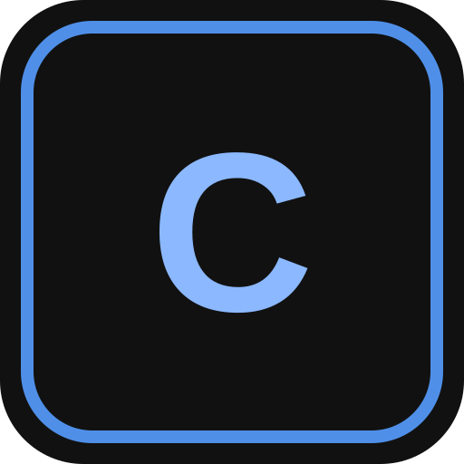
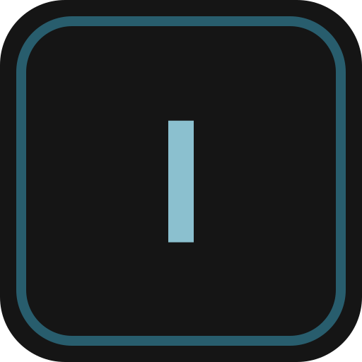
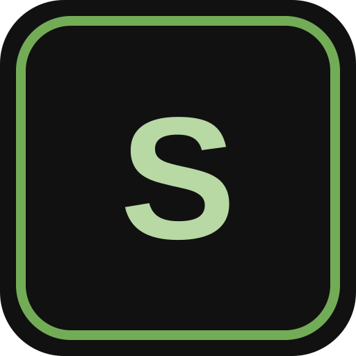

# Louhos

[rasse2009.fi/louhos →](https://rasse2009.fi/louhos/)

| | Alusta | |
| :---: | :--- | :--- |
|  | **Cue** Rakenna ja aja cue-listoja. Lähetä MIDI-, OSC- ja HTTP-toimintoja cueista tai omista painikkeista. | [Avaa →](https://rasse2009.fi/louhos/cue/) [Käyttöohjeet](https://rasse2009.fi/louhos/cue/documentation/) |
|  | **Interval** Seuraa vMixin Program- ja Preview-inputteja sekä kameranvaihtojen kestoa. Valitse seurattavat inputit, nimeä ne ja jaa ne välilehdille. | [Avaa →](https://rasse2009.fi/louhos/interval/) [Käyttöohjeet](https://rasse2009.fi/louhos/interval/documentation/) |
|  | **Equipment** Kokoa kalusto samaan näkymään. | [Avaa →](https://rasse2009.fi/louhos/equipment/) [Käyttöohjeet](https://rasse2009.fi/louhos/equipment/documentation/) |
|  | **Stage** Lavakello-ohjelmisto. | [Avaa →](https://rasse2009.fi/louhos/stage/) [Käyttöohjeet](https://rasse2009.fi/louhos/stage/documentation/) |
|  | **Mobile** Louhoksen mobiilikäyttöliittymä. | [Avaa →](https://rasse2009.fi/louhos/mobile-v2/) |

### Rajattu käyttö

**File Transfer** — Jaa tiedostoja linkillä. Järjestä ne projekteihin ja kansioihin, aseta linkille voimassaolo ja salasana sekä hallitse latauksia, esikatselua ja kommentointia. Käyttö edellyttää ylläpitäjän myöntämää oikeutta.

### Tulossa

| Alusta | Kuvaus |
| --- | --- |
| **Plan** | Tilojen, laitteiden ja niiden välisten yhteyksien suunnittelu. |
| **Vision** | Vedosten ja visuaalisen materiaalin tarkastelu. |
| **Comms** | Intercom-järjestelmä, joka toimii langattomasti internetin välityksellä. |
| **Show** | Diojen, median ja näyttöjen ohjaus. |
